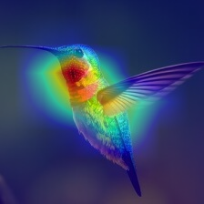
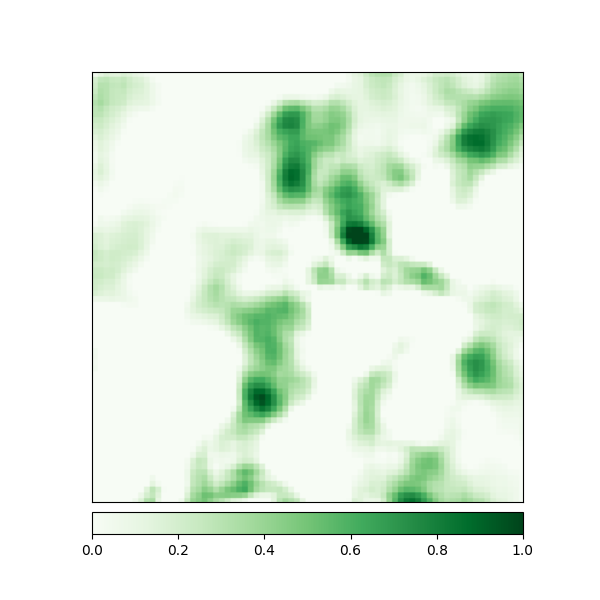
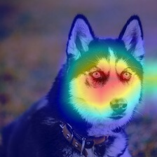
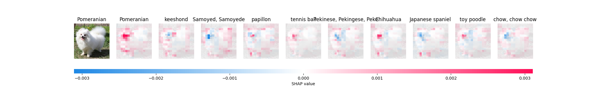
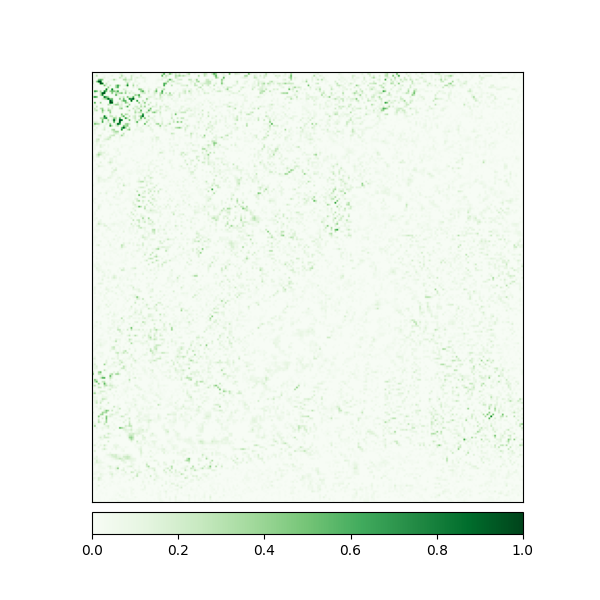

# Model Explainability Log Book

## Images

### 1. Hot Dog Image Explainability features:

Original Image             |  Integrated Gradients  |   IG with Noise tunnel | Gradient SHAP 
:-------------------------:|:-------------------------: |:-------------------------: |:-------------------------:
  |   |  |  
Occulsion | GradCam | GradCam++ | Saliency |
 |  |  |  |

SHAP
 |

### 2. Hummingbird Image Explainability features:

Original Image             |  Integrated Gradients  |   IG with Noise tunnel | Gradient SHAP
:-------------------------:|:-------------------------: |:-------------------------: |:-------------------------:
  |   |  | 
Occulsion | GradCam | GradCam++ | Saliency |
 |  |  |  |

SHAP
 |

### 3. Husky Image Explainability features:

Original Image             |  Integrated Gradients  |   IG with Noise tunnel | Gradient SHAP
:-------------------------:|:-------------------------: |:-------------------------: |:-------------------------:
  |   |  | 
Occulsion | GradCam | GradCam++ | Saliency |
 |  |  |  |

SHAP
 |

### 4. Hyena Image Explainability features:

Original Image             |  Integrated Gradients  |   IG with Noise tunnel | Gradient SHAP
:-------------------------:|:-------------------------: |:-------------------------: |:-------------------------:
  |   |  | 
Occulsion | GradCam | GradCam++ | Saliency |
 |  |  |  |

SHAP
 |

### 5. Lion Image Explainability features:

Original Image             |  Integrated Gradients  |   IG with Noise tunnel | Gradient SHAP
:-------------------------:|:-------------------------: |:-------------------------: |:-------------------------:
  |   |  | 
Occulsion | GradCam | GradCam++ | Saliency |
 |  |  |  |

SHAP
 |

### 6. Persian Cat Image Explainability features:

Original Image             |  Integrated Gradients  |   IG with Noise tunnel | Gradient SHAP
:-------------------------:|:-------------------------: |:-------------------------: |:-------------------------:
  |   |  | 
Occulsion | GradCam | GradCam++ | Saliency |
 |  |  |  |

SHAP
 |

### 7. Pomeranian Image Explainability features:

Original Image             |  Integrated Gradients  |   IG with Noise tunnel | Gradient SHAP
:-------------------------:|:-------------------------: |:-------------------------: |:-------------------------:
  |   |  | 
Occulsion | GradCam | GradCam++ | Saliency |
 |  |  |  |

SHAP
 |

### 8. Red Fox Image Explainability features:

Original Image             |  Integrated Gradients  |   IG with Noise tunnel | Gradient SHAP
:-------------------------:|:-------------------------: |:-------------------------: |:-------------------------:
  |   |  | 
Occulsion | GradCam | GradCam++ | Saliency |
 |  |  |  |

SHAP
 |

### 9. Scorpion Image Explainability features:

Original Image             |  Integrated Gradients  |   IG with Noise tunnel | Gradient SHAP
:-------------------------:|:-------------------------: |:-------------------------: |:-------------------------:
  |   |  | 
Occulsion | GradCam | GradCam++ | Saliency |
 |  |  |  |

SHAP
 |

### 10. Tiger Image Explainability features:

Original Image             |  Integrated Gradients  |   IG with Noise tunnel | Gradient SHAP
:-------------------------:|:-------------------------: |:-------------------------: |:-------------------------:
  |   |  | 
Occulsion | GradCam | GradCam++ | Saliency |
 |  |  |  |

SHAP
 |

## Text

### Text Explainability features:
Please refer to the [notebook](src/text_exp.ipynb) for the explainability features of the text model.
